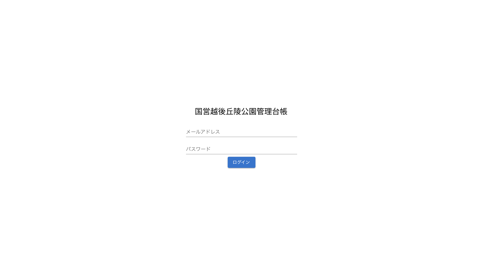
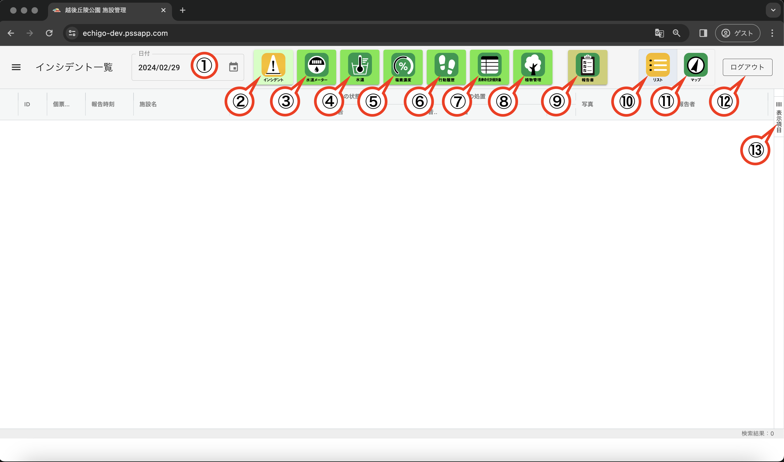
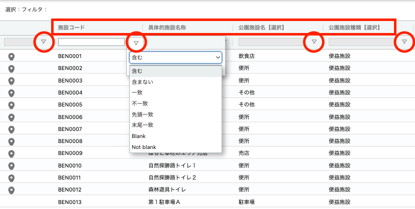
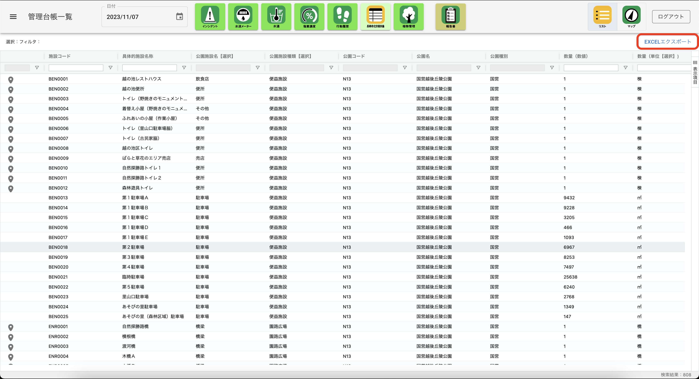
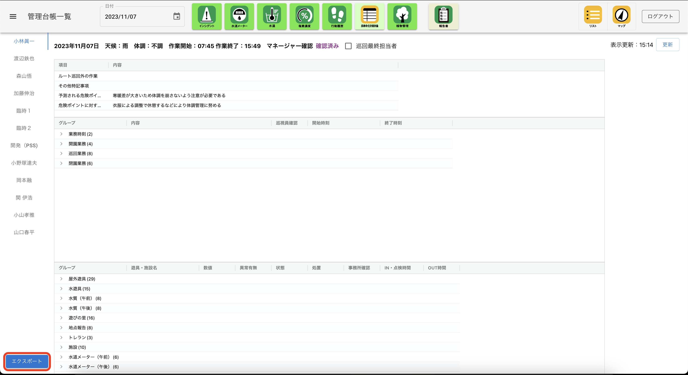
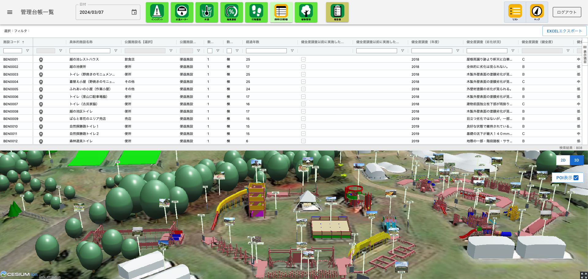
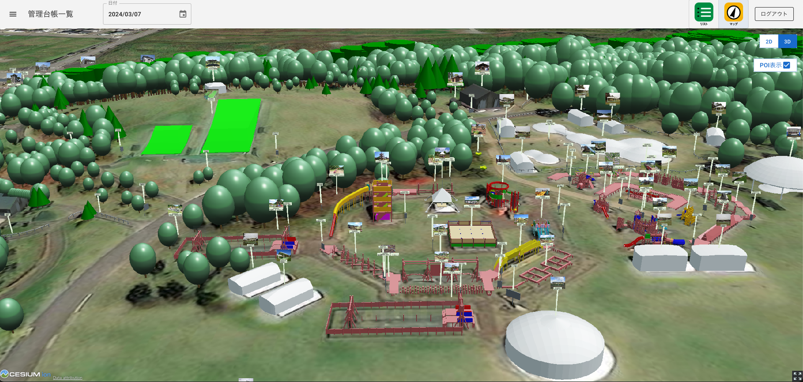
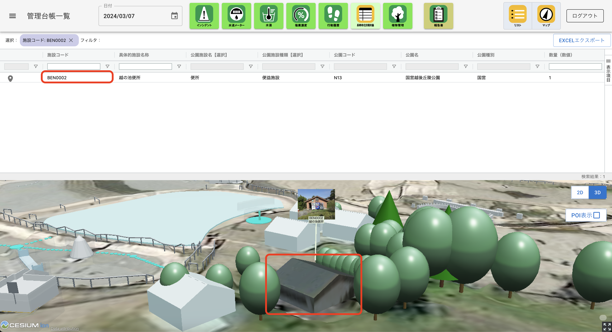

# 操作マニュアル

# 1 本書について

本書では、公園管理台帳システム（以下「本システム」という。）の操作手順について記載しています。

# 2 使い方

## 2-1 ログイン画面

本システムをデプロイしたURLにアクセスすると以下の画面が表示されます。設定したログインID（メールアドレス）、パスワードを入力することでシステムのトップ画面が表示されます。

## 2-2 トップ画面

ログインすると以下の画面が表示されます。

① 日付選択

　デフォルトでは本システムを開いた日が表示されますが、任意の年月日を選択することができます。

② インシデント一覧

　点検アプリで入力したインシデントを一覧表示することができます。また、登録された音声、画像を個表で、登録した位置を地図上で確認することができます。

③ 水道メータ

　点検アプリで入力した水道メータの値と点検時刻を一覧表示することができます。

④ 水温

　点検アプリで入力した水温と計測時刻を一覧表示することができます。

⑤ 塩素濃度

　点検アプリで入力した塩素濃度と計測時刻を一覧表示することができます。

⑥ 行動履歴

　点検アプリで取得された点検員の行動履歴（点検のために立ち寄った設備名と入退場時刻）を一覧表示することができます。

⑦ 長寿命化計画対象

　長寿命化計画対象の設備の属性を一覧表示、検索、並べ替え、出力する他、連動して地図上に表示することができます。

⑧ 植物管理

　長寿命化計画の対象となっていない樹木などの情報を一覧表示、検索、並べ替え、出力する他、連動して地図上に一覧表示することができます。

⑨ 報告書

　①で指定した日の巡視員の1日の業務報告をマネージャーが確認し、承認することができます。また、巡視員ごとのデータをエクセル形式で出力することもできます。

⑩ リスト

　②〜⑧の結果表示を一覧表形式に切り替えることができます。なお、システムのデフォルトは一覧表示となっています。

⑪ マップ

　②〜⑧の結果表示を地図に切り替えることができます。

⑫ ログアウト

　システムからログアウトします。

⑬ 表示項目

　②〜⑧の一覧表示で画面上に表示する項目を選択できます。

## 2-2 一覧画面

① データの検索・絞り込み

・2-1②〜⑧の一覧画面で、列名（図中赤四角）を押下すると、その列の値に従って昇順、降順の並べ替えが行えます。また、フィルタボタン（図中赤丸印）を押下して、「含む」などの条件を選択し、基準となる値を入力することでデータの絞り込みが行えます。また各列の先頭にある入力ボックスに検索したい数値や文字列を入力すると、該当するレコードの絞り込みが行えます。

② データのエクスポート

・2-1⑦〜⑨の一覧表は検索や絞り込みの結果を反映した状態でエクセルファイルとして出力することができます。⑦長寿命化計画対象、⑧植物管理は画面右上の「EXCELエクスポート」ボタンを、⑨の報告書は画面左下の「エクスポート」ボタンを押下することでデータのダウンロードが開始します。

## 2-3 地図画面

・2-1⑦長寿命化計画対象、および⑧植物管理の画面では⑪の「マップ」ボタンを押下すると一覧表の下に地図が表示されます。さらに、地図が表示されている状態で⑩の「リスト」ボタンを押下すると、地図が全画面で表示されます。再度「リスト」ボタンを押下すると、一覧と地図が画面の上下に表示される状態に戻り、さらに「マップ」ボタンを押下すると、地図が非表示となり、一覧表示のみの初期状態に戻ります。

・地図画面の右上には2Dと3Dの表示を切り替えるボタンがあります。表示したい方のボタンを押下すると画面が切り替わります。

・地図画面の2D /３D切り替えボタンの下に「POI表示」チェックボックスがあります。デフォルトではチェックが入っていませんが、チェックを入れると施設名称と名称がビルボードとして表示されます。

## 2-4 一覧・地図の連動

・2-1⑦長寿命化計画対象、および⑧植物管理の画面で、一覧、地図を同時に表示した状態（⑩と⑪を両方押下した状態）では、施設コード（"BEN0002"など）を押下した時、地図画面は選択した施設にズームインし、POIのビルボードが表示されます。また、地図画面で施設を選択（押下）した場合は、一覧が選択した施設に絞り込まれます。

